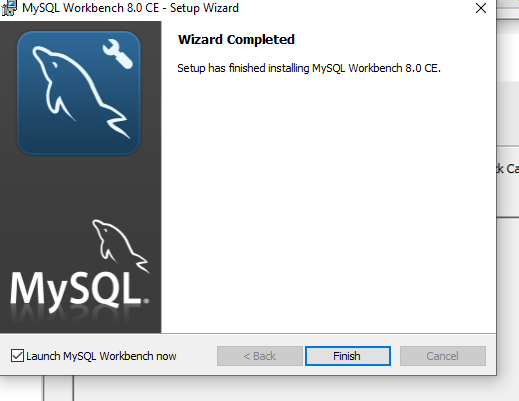

# Dev_Setup
Setup Development Environment

#Assignment: Setting Up Your Developer Environment

#Objective:
This assignment aims to familiarize you with the tools and configurations necessary to set up an efficient developer environment for software engineering projects. Completing this assignment will give you the skills required to set up a robust and productive workspace conducive to coding, debugging, version control, and collaboration.

#Tasks:

1. Select Your Operating System (OS):
   Choose an operating system that best suits your preferences and project requirements. Download and Install Windows 11. https://www.microsoft.com/software-download/windows11

2. Install a Text Editor or Integrated Development Environment (IDE):
   Select and install a text editor or IDE suitable for your programming languages and workflow. Download and Install Visual Studio Code. https://code.visualstudio.com/Download
3. Set Up Version Control System:
   Install Git and configure it on your local machine. Create a GitHub account for hosting your repositories. Initialize a Git repository for your project and make your first commit. https://github.com

4. Install Necessary Programming Languages and Runtimes:
  Instal Python from http://wwww.python.org programming language required for your project and install their respective compilers, interpreters, or runtimes. Ensure you have the necessary tools to build and execute your code.

5. Install Package Managers:
   If applicable, install package managers like pip (Python).

6. Configure a Database (MySQL):
   Download and install MySQL database. https://dev.mysql.com/downloads/windows/installer/5.7.html

7. Set Up Development Environments and Virtualization (Optional):
   Consider using virtualization tools like Docker or virtual machines to isolate project dependencies and ensure consistent environments across different machines.

8. Explore Extensions and Plugins:
   Explore available extensions, plugins, and add-ons for your chosen text editor or IDE to enhance functionality, such as syntax highlighting, linting, code formatting, and version control integration.

9. Document Your Setup:
    Create a comprehensive document outlining the steps you've taken to set up your developer environment. Include any configurations, customizations, or troubleshooting steps encountered during the process. 

#Deliverables:
- Document detailing the setup process with step-by-step instructions and screenshots where necessary.
- A GitHub repository containing a sample project initialized with Git and any necessary configuration files (e.g., .gitignore).
- A reflection on the challenges faced during setup and strategies employed to overcome them.

#Submission:
Submit your document and GitHub repository link through the designated platform or email to the instructor by the specified deadline.

#Evaluation Criteria:**
- Completeness and accuracy of setup documentation.
- Effectiveness of version control implementation.
- Appropriateness of tools selected for the project requirements.
- Clarity of reflection on challenges and solutions encountered.
- Adherence to submission guidelines and deadlines.

Note: Feel free to reach out for clarification or assistance with any aspect of the assignment.

# Answers

# answer 1.
Steps for setting up windows 
First you go to 1. CHECK FOR COMPATIBILITY
Windows 11 won’t work for every PC. At a minimum, your device must have the following specs:
•	64-bit processor with at least 2 cores and 1 GHz processing speed
•	4GB RAM
•	64GB storage space (in addition to the space for the operating system installation software)
•	DirectX 12 or later graphics card with WDDM 2.0 driver
•	A high-def display of 720p
•	TPM 2.0
•	Secure Boot-capable UEFI firmware
Can you still install Windows via USB if your PC isn't compatible? Possibly. You may still be able to download and install it on a computer that doesn't meet all of these requirements, but your experience may not be satisfactory.
2 CHECK YOUR DEVICE FOR AVAILABLE MEMORY
If you haven't cleaned up your computer's storage in a while, now is the best time. You'll need at least 5.1GB of extra storage space on all of the devices involved in this process because that’s the Windows 11 ISO file size.
You need 5.1GB free on the computer you’re downloading the file to, the USB drive, and the computer on which you’re installing the operating system. Not all USB drives have this much memory, and drives with just a bit more memory (6GB, for example) may not meet your needs. To be safe, buy a USB device with ample space to spare.

What if you can't find enough files to delete from your computer? Delete temporary files, any other files you no longer need, and any programs you can easily reinstall later. To be safe, make sure you have the purchase information and license keys for any programs you delete.
3. DOWNLOAD THE ISO FILE TO YOUR DEVICE (ANOTHER DEVICE)
Unlike prior versions of Microsoft Windows, you don’t need to sign in to your Microsoft account to download the ISO file. Just follow these steps:
1.	Navigate to the Create Windows 11 installation media link, and click Download Now.
2.	The download for the Media Creation Tool will begin.
3.	Once the tool downloads, double-click on the file in your download and run it. You may be asked for permission to run the program, so go ahead and approve it.
4.	Now that you have the Media Creation Tool running, follow the directions to download the ISO file (the file used to install Windows 11) to your device. Make sure you select USB Flash Drive when prompted to download the file directly to your USB drive and format it properly for installation later.
Once the download completes, move on to the next step.

4. REMOVE THE USB
When you receive a notification that the file transfer is finished, use the "eject" function on your USB utility to prepare it for removal before you pull it out of the computer.
5. RUN WINDOWS 11 FROM A USB
With the Windows 11 installation file on your thumb drive, you’re almost there! The USB flash drive should have been formatted properly when you used the Windows Media Creation Tool. You do not have to use a third-party application to make it bootable.

•	Plug the USB drive into the computer and restart the computer.
•	Before the computer fully turns back on, hold the F8 key. The exact command will depend on your computer. Note: You must do this before the Windows or manufacturer's brand logo appears on your screen. If you see the logo, you waited too long and must restart again.
•	When prompted, choose the boot order and select the USB drive option as first. You’ll then be told to press any key to continue booting from your specified location.
•	Your computer should start up as normal, but with Windows 11 prepared to install and run at the start-up screen.
6. SET UP WINDOWS 11
Now that your PC is running on Windows 11, you need to set up your account and preferences for each time you log on. Many of these preferences are similar to Windows 10, but there are some differences.
To start using Windows 11, choose the language you want for installation, your time zone, currency format, and how you want to input data (for most people, this is the keyboard). There are some pre-set definitions to set, but you may not need to tinker with these additional settings.
With everything specified, click the Install Now button.: : https://www.microsoft.com/software-download/windows11  

# answer 2. 

For visual studio code installation got to  https://code.visualstudio.com/Download. if you are using windows you will take the one for windows ( just download the one suited for your operating systems). 
And then you press next until you see a button to install then install. Wait until it’s finished then it say finish then you’re done. 

 # answer 3.

 # answer 4.

For python installation you have to go to https://www.python.org/downloads/Then  press enter it lead to this window:   
Then you press windows if you using wondows operating system, if you are use macOS you will press macOS, so as linux. 
After finishing to download, you present in it . it will then start to install. After finishing installation you can eighter choose to check if it is available by going to command prompt or powershell. 
 
 # answer 5.

To install pip. You will go to command prompt and then call: pythom –m pip install then execute. Then it will install . you can also check your PIP version by saying : python –m pip –version :   

# answer 6
For mysql database I went to this link below: https://dev.mysql.com/downloads/windows/installer/5.7.html 
it then took me to this page below. 
then I choose the one that has more user. After that I went to my downloads since it was  a file, I then started the installation process. 
I had to install mysql workbernch aside since it didn't come with the mysql i had downloaded 
  

 

 

